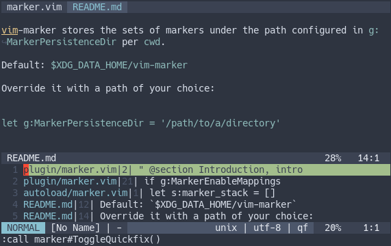

# vim-marker



vim-marker provides a custom mark stack that is stored per working
directory.

**Features**

* toggle marks
* cycle through marks across buffers
* persistent
* populate all marks in a quickfix window

## Configuration

### g:MarkerPersistenceDir

vim-marker stores the sets of markers under the path configured in `g:MarkerPersistenceDir` per `cwd`.

Default: `$XDG_DATA_HOME/vim-marker`

Override it with a path of your choice:

```
let g:MarkerPersistenceDir = '/path/to/a/directory'
```

### Mappings

vim-marker comes with following default mappings:

```
" Mapping to add or remove a marker at the current cursor position.
" Also works in the quickfix window.
let g:MarkerToggleMarkMapping = '<m-m>'

" Mapping for jumping to next mark.
let g:MarkerNextMarkMapping = '<m-j>'

" Mapping for jumping to previous mark.
let g:MarkerPrevMarkMapping = '<m-k>'

" Toggle quickfix window with current marks.
let g:MarkerQuickfixToggleMapping = '<m-;>'
```
Override these in your `.vimrc` to your likings.

You can also disable the default mappings completely via:

```
let g:MarkerEnableMappings = 0
```

Reset all markers by running:

```
:call marker#ResetMarkers()
```
